## Table of Contents

-   [Introduction](#introduction)
-   [Users - Admin/Client](#admin-client)
-   [Objectives](#objectives)
-   [Landing Page](#landing-page)
-   [Admin Module](#admin-module)
-   [Client Module](#client-module)

## Introduction

The project titled "Muslim Affairs Office Information System" is specifically designed for the use of the Muslim Affairs Office. Its aim is to automate the office's daily operations and transactions, enhancing services for the Muslim community and residents overall. Traditionally, the office has relied on manual methods involving paper and pen for encoding and record-keeping, leading to inefficiencies and errors. Residents have had to physically visit the office for services and certification requests, which is outdated and inconvenient. Therefore, there's a pressing need to modernize and improve the system to better serve the Muslim community.

Established in April 2010 by the Provincial Governor of South Cotabato, Honorable Reynaldo Sucayan Tamayo, Jr., alongside Muslim leader Sultan Rahman Paglas Ebrahim Al-Hajj, the Muslim Affairs Office, known as the Tupi Muslim Council of Elders, assists the Muslim community in Tupi Municipality. It operates under the Office of the Mayor within the Local Government Unit of Tupi.

Several challenges necessitate an innovative solution in the form of the Muslim Affairs Office Information System:

1. Difficulty in effectively delivering information to the community, sometimes resulting in misinformation.
2. Human errors in manual report writing.
3. Limited accessibility for the community to contact or reach out to the office.
4. Challenges for residents in remote areas to communicate or report issues promptly.
5. Lack of proper document storage, risking loss or exposure of confidential information.

To address these challenges, the proposal suggests developing a comprehensive computerized system tailored to the needs of the Muslim Affairs Office. Benefits of such a system include streamlining data processing, reducing errors, improving document management efficiency, and facilitating quicker access to information.

The researchers have created an Information System to meet these needs, providing software infrastructure and trained personnel to manage and disseminate information effectively. This system organizes and stores data for future use, leveraging technology to enhance organizational processes and improve overall efficiency.

## Admin Client

1. **Muslim Individuals**:

    - Users who access the system to receive information, news reports, and updates relevant to the Muslim community.
    - Utilize the system to interact with the messenger bot for reporting problems or cases requiring assistance.
    - Benefit from the system's efficiency in accessing accurate information and reports submitted by the community.

2. **Admin/User (Moderator)**:
    - Responsible for managing and maintaining the system.
    - Has access to all features and functionalities of the system.
    - Manages the delivery of information, news reports, and current events to the Muslim community.
    - Ensures records are easily accessible, accurate, complete, and usable.
    - Monitors and responds to messages received through the messenger bot, addressing community concerns or issues promptly.
    - Generates information and statistical reports on settled and unsettled cases for evaluation and decision-making.
    - Analyzes data to make informed decisions regarding the affairs of the Muslim community.

## Objectives

• To be able to develop a system that has an effective method of delivering information, news reports, and current events to the Muslim Community;
• to develop a system that can easily find records, ensuring accurate, complete, accessible, and usable;
• to be able to develop a system that enhances receiving accurate information, reports, and efficiency, the system automatically records all information and reports that have been submitted;
• to be able to develop a system of that messenger bot that can send/reply to messages where the Muslim community can interact and report any problems/cases that need help or assistance immediately;
• to be able to develop a system that will automatically generate information, and statistical reports of the settled/unsettled cases for evaluation and make it easy for the moderator to analyze data and make informed decisions.

### Landing Page

-   Here are the images related to the Information posted in Muslim Affairs Office Information System

<table>
  <tr>
    <td align="center">
      <b>Introduction</b> 
      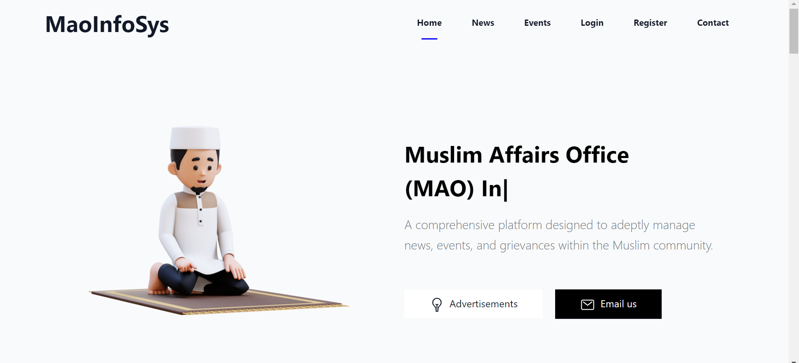
    </td>
    <td align="center">
      <b>Advertisements</b> 
      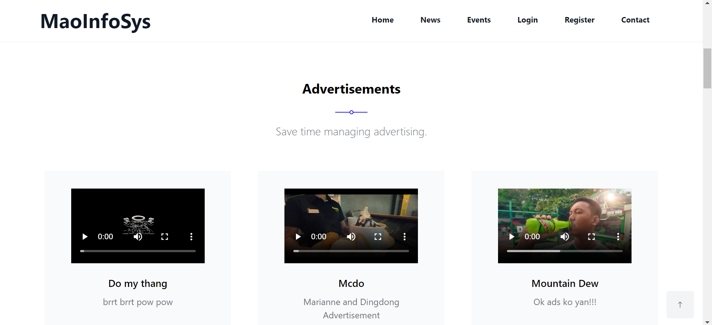
    </td>
    <td align="center">
      <b>Public News</b> 
      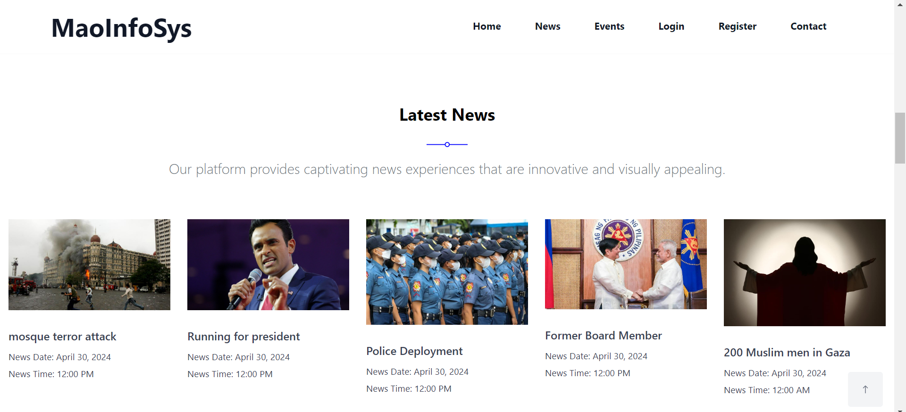
    </td>
  </tr>
  <tr>
    <td align="center">
      <b>Public Events</b> 
      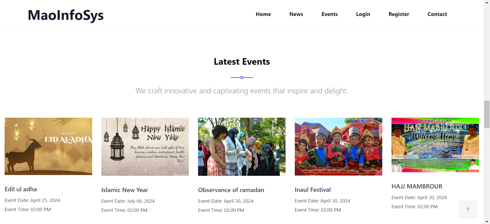
    </td>
    <td align="center">
      <b>Public Contact</b> 
      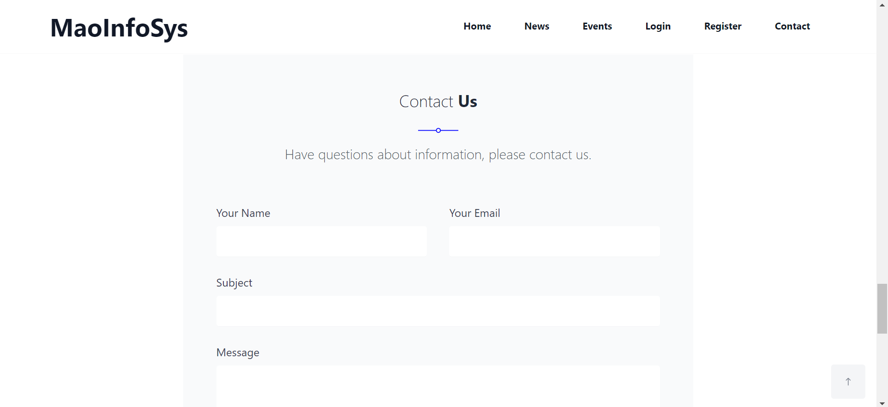
    </td>
    <td align="center">
      <b>Footer</b> 
      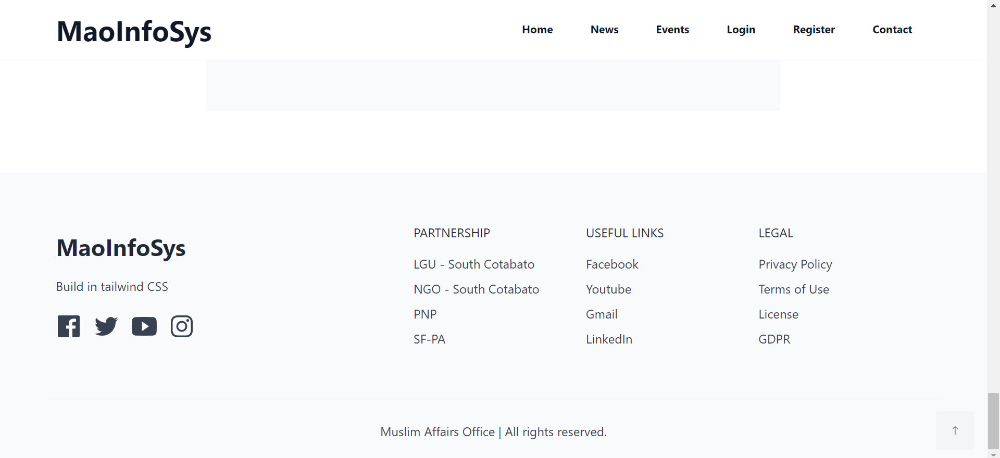
    </td>
  </tr>
</table>

## Admin Module

-   Here are the images related to the Admin Side of Muslim Affairs Office Information System (MAO Infosys) project:

<table>
  <tr>
    <td align="center">
      <b>Login</b> 
      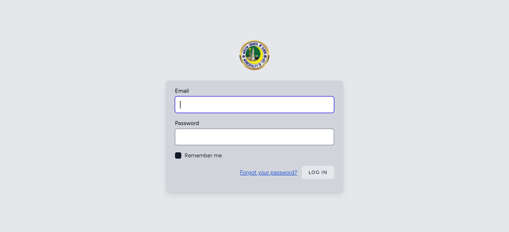
    </td>
    <td align="center">
      <b>Register</b> 
      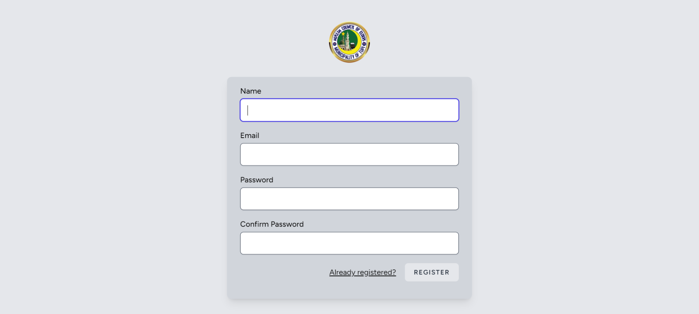
    </td>
    <td align="center">
      <b>Users</b> 
      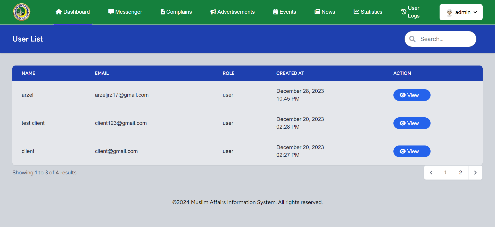
    </td>
  </tr>
  <tr>
    <td align="center">
      <b>Messenger</b> 
      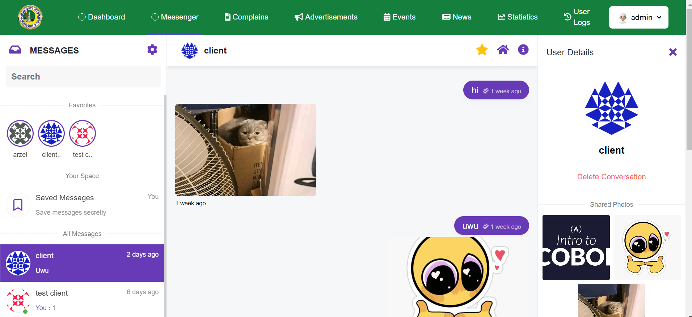
    </td>
    <td align="center">
      <b>Complains</b> 
      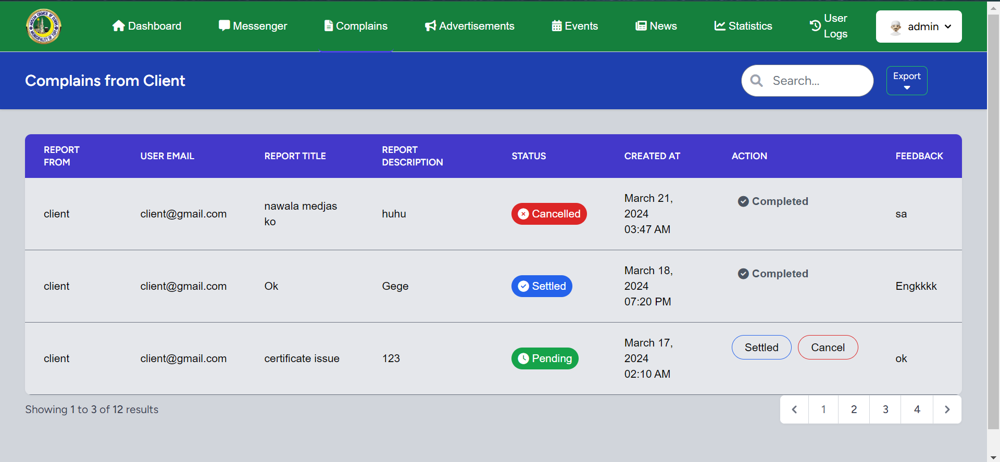
    </td>
    <td align="center">
      <b>Advertisements</b> 
      
    </td>
       <td align="center">
      <b>Events</b> 
      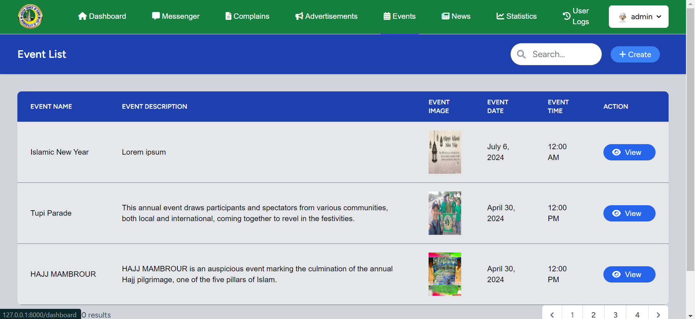
    </td>
       <td align="center">
      <b>News</b> 
      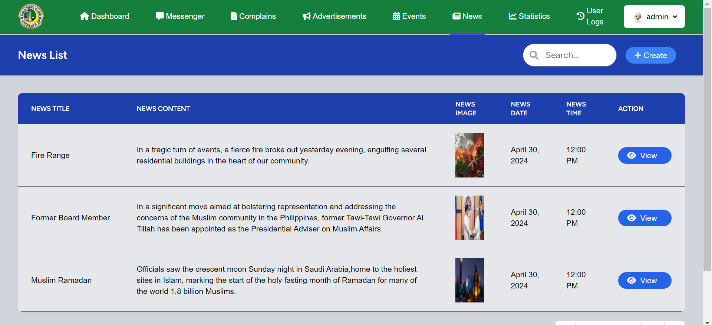
    </td>
       <td align="center">
      <b>Statistics</b> 
      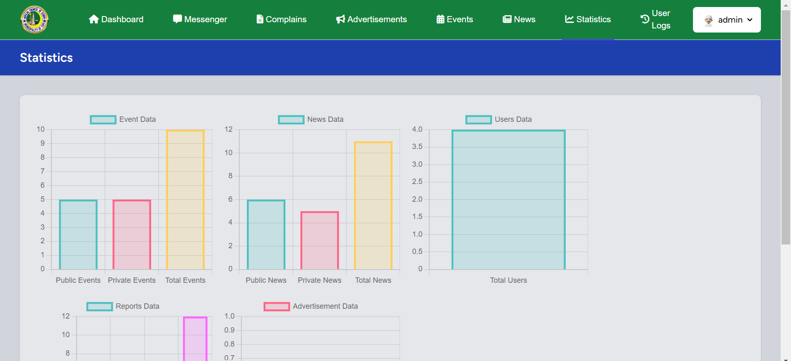
    </td>
       <td align="center">
      <b>User Logs</b> 
      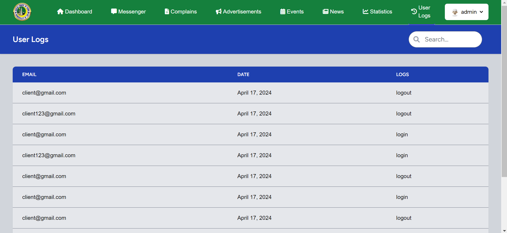
    </td>
  </tr>
</table>

## Client Module

-   Here are the images related to the Client Side of Muslim Affairs Office Information System (MAO Infosys) project:

<table>
  <tr>
    <td align="center">
      <b>Login</b> 
      
    </td>
    <td align="center">
      <b>Register</b> 
      
    </td>
    <td align="center">
      <b>Private News</b> 
      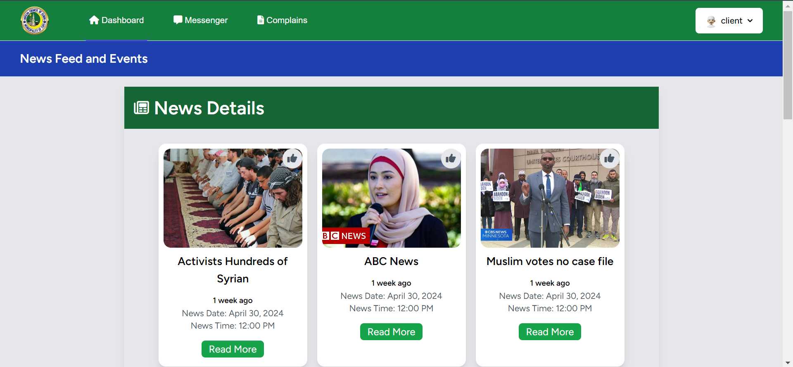
    </td>
  </tr>
  <tr>
    <td align="center">
      <b>Private Events</b> 
      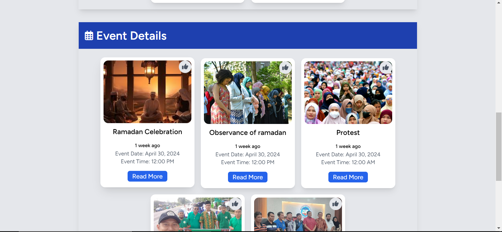
    </td>
    <td align="center">
      <b>Messenger</b> 
      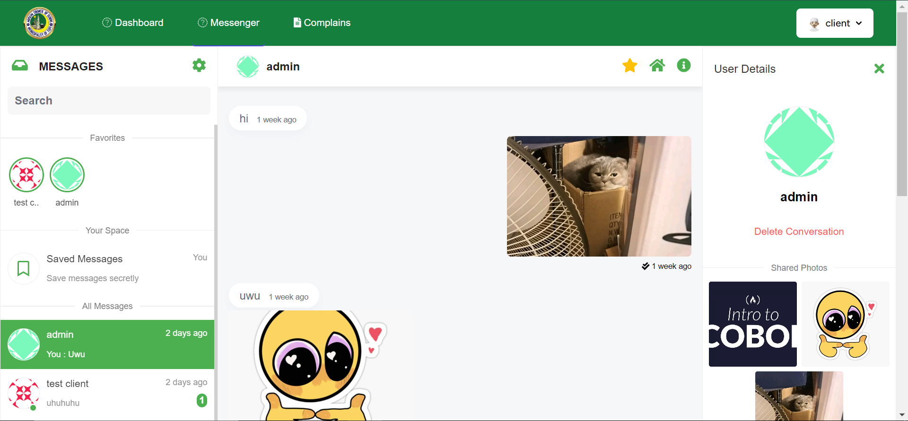
    </td>
    <td align="center">
      <b>Complains</b> 
      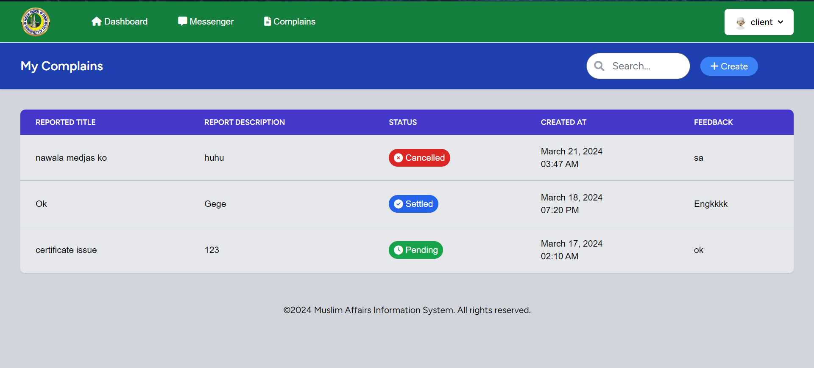
    </td>
  </tr>
</table>
